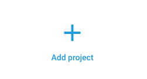
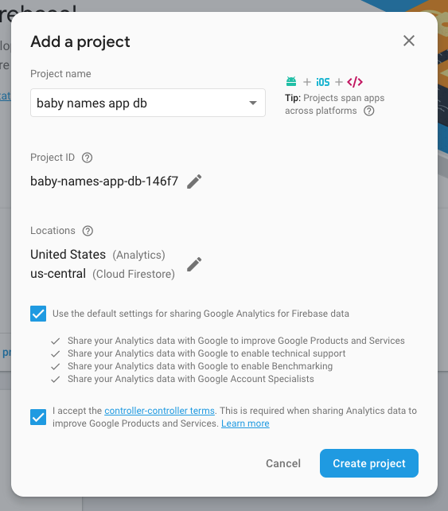
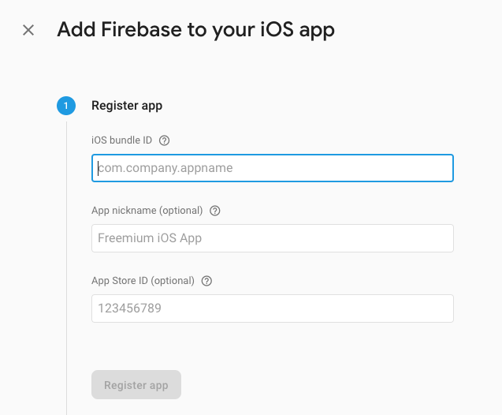
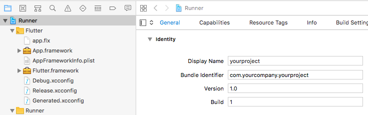
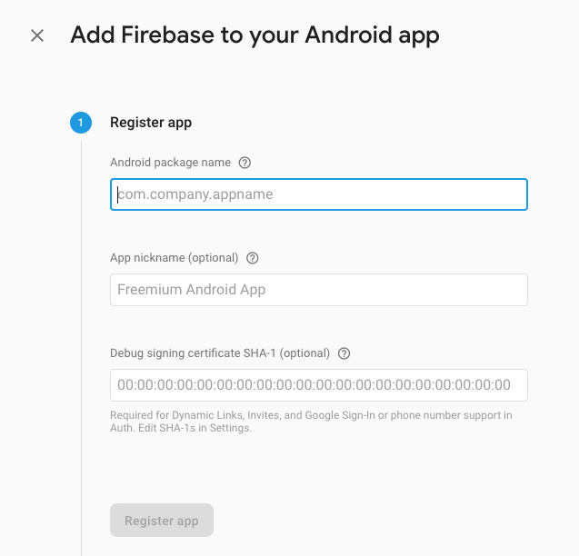
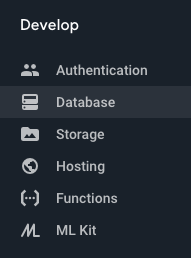
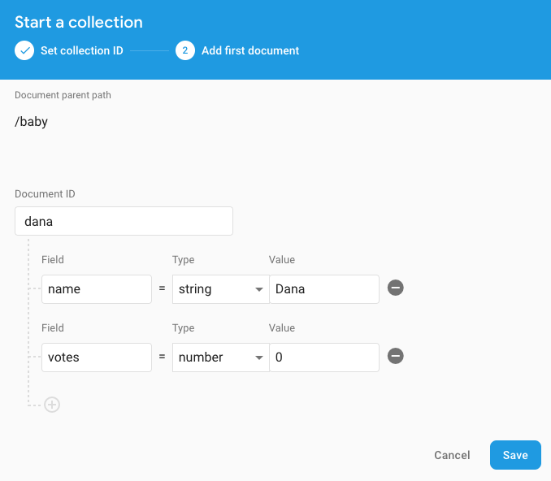
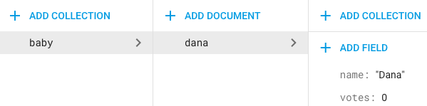
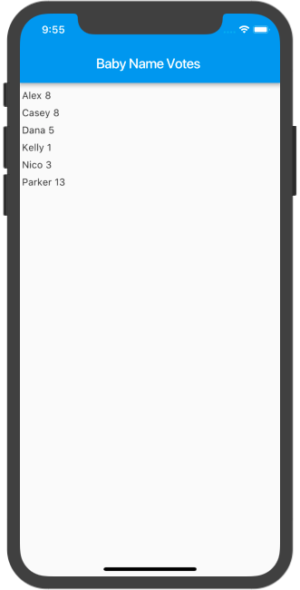

# Firebase for Flutter

[Codelab Feedback](https://github.com/flutter/flutter/issues)


## Prerequisites
Duration: 01:00


<aside class="special">

If you came here looking for the old Friendlychat codelab, it has been deprecated, but all the code for it  [is in this repository](https://github.com/flutter/friendlychat-steps).
</aside>

If you're familiar with object-oriented programming concepts you should be able to complete this codelab. You don't need previous experience with Dart, mobile programming, or Firebase, although completing an  [introductory Flutter codelab](https://codelabs.developers.google.com/codelabs/first-flutter-app-pt1) first will be helpful.


## Introduction
Duration: 03:00


Flutter and Firebase work hand-in-hand to help you build mobile apps in record time.  [Flutter](https://flutter.io/) is Google's SDK for building mobile apps for iOS and Android.  [Firebase](https://firebase.google.com/) gives you access to backend services for mobile applications — including authentication, storage, database, and hosting — without maintaining your own servers.

In this codelab, you'll learn how to create a Flutter app that uses Firebase. The app helps new parents choose baby names by letting friends and family vote for their favorites. Specifically, the app accesses a  [Cloud Firestore](https://firebase.google.com/products/firestore/), and allows the user to update the Cloud Firestore using a transaction.

Here's what the final app will look like, on both iOS and Android. Tapping a name adds your vote.

[Here's a short video](https://youtu.be/DqJ_KjFzL9I?list=PLOU2XLYxmsIJ7dsVN4iRuA7BT8XHzGtCr) that demonstrates building a similar app in real time. It provides a good overview of the steps you will encounter in this codelab.


## Set up your Flutter environment
Duration: 01:00


You need two pieces of software to complete this lab:

* The  [Flutter SDK](https://flutter.io/get-started/install/).
*  [An editor](https://flutter.io/get-started/editor/) (you can use your preferred editor).

You can run this codelab using one or more of the following devices:

* A physical device (i.e. phone):  [Android](https://flutter.io/setup-macos/#set-up-your-android-device) or  [iOS](https://flutter.io/setup-macos/#deploy-to-ios-devices).
* The  [iOS simulator](https://flutter.io/setup-macos/#set-up-the-ios-simulator). (Requires installing XCode tools.)
* The  [Android emulator](https://flutter.io/setup-macos/#set-up-the-android-emulator). (Requires setup in Android Studio.)


## Create a new Flutter app
Duration: 03:00


Follow the  [Get Started: Test Drive](https://flutter.io/get-started/test-drive/) guide to create a new Flutter app. Name the app `baby_names` instead of `myapp`. The instructions differ depending on your editor. If you're using an IDE, a new app is usually called a **project**.

<aside class="special">

**Tip:** If you don't see "New Flutter Project" as an option in your IDE, make sure you have the  [plugins installed for Flutter and Dart](https://flutter.io/get-started/editor/#androidstudio).
</aside>

In this codelab, you'll be editing `lib/main.dart`.


## Create a Firebase project
Duration: 02:00


1. If you have a Firebase account,  [sign in to it](https://firebase.google.com/). If not, you need to  [create an account](https://firebase.google.com/pricing/). A free plan will be sufficient for this codelab (and most development).
2. In the  [Firebase console](https://console.firebase.google.com), click on **Add project**.

3. Name your project (for example, "baby names app db") and set the Country/region to the location of your company or organization. Click **Create Project**.

4. After a minute your project will be ready. Click **Continue**.


## Platform-specific Firebase configuration
Duration: 10:00


Once you have created a Firebase project, you can configure one (or more) apps to use that project. This is done by registering your app's platform-specific ID with Firebase and generating configuration files for your app.

If your Flutter app will be released on both iOS and Android, you need to register both the iOS and Android versions within the same Firebase project. If not, just skip the unneeded section.

In the top-level directory of your Flutter app, there are subdirectories called `ios` and `android`. These directories hold the platform-specific configuration files for iOS and Android, respectively.

1. In the  [Firebase console](https://console.firebase.google.com), be sure **Project Overview** is selected in the left nav. Click **Add Firebase to your iOS app** to get this:

The main thing you need to fill in is the **iOS bundle ID**, which you will determine in the following two steps. ( [More information about bundle IDs](https://cocoacasts.com/what-are-app-ids-and-bundle-identifiers/)).
2. In a terminal window, go to the top-level directory of your Flutter app and run the command `open ios/Runner.xcworkspace` to open Xcode. ( [More information on Xcode property lists](https://developer.apple.com/library/content/documentation/General/Reference/InfoPlistKeyReference/Articles/AboutInformationPropertyListFiles.html)).
3. In Xcode, click the top-level **Runner** in the left pane to show the **General** tab in the right pane, as shown in the figure below. Copy the **Bundle Identifier**. 



4. In Firebase, paste the **Bundle Identifier** into the **iOS bundle ID** field, shown in the figure above. (The actual values of "yourcompany" and "yourproject" depend on what you named your Flutter app.)
5. In Firebase, click **Register App**.
6. Continuing in Firebase, follow the instructions to download the config file `GoogleService-Info.plist`.
7. In Xcode, notice that **Runner** has a subfolder also called **Runner**, as shown in the figure above. Drag the `GoogleService-Info.plist` file you just downloaded into that **Runner** subfolder. In the **Choose options for adding these files** dialog that appears, click **Finish**.
8. In Firebase, click **Next** and skip the remaining steps and go back to the main page of the Firebase console.

1. In the  [Firebase Console](https://console.firebase.google.com), be sure **Project Overview** is selected in the left nav. Click **Add Firebase to your Android app**. If you have already added an app (for example, the iOS app from the preceding section), click **Add another App** to get to this.

2. In your Flutter app directory, open the file `android/app/src/main/AndroidManifest.xml`. The string value of the `manifest` element's `package` attribute is the Android package name (something like `com.yourcompany.yourproject`). Copy this value. 
3. In the Firebase console, paste the copied package name into the **Android package name** field. ( [More information about package and application IDs](https://developer.android.com/studio/build/application-id.html)).
4.  *Optional* : If you plan to use  [Google Sign In](https://firebase.google.com/docs/auth/) or  [Firebase Dynamic Links](https://firebase.google.com/products/dynamic-links/), you need to fill In the **Debug signing certificate SHA-1** field. Follow the instructions in the  [Authenticating Your Client](https://developers.google.com/android/guides/client-auth) guide to get the **debug certificate fingerprint** value and paste it in.
5. Click **Register App**.
6. Follow the instructions to download the file `google-services.json`. Move the `google-services.json` file into the `android/app` directory of your Flutter app.
7. In Firebase, skip the remaining steps and go back to the main page of the Firebase console.
8. Finally, you need the  [Google Services Gradle plugin](https://developers.google.com/android/guides/google-services-plugin) to read the `google-services.json` file that was generated by Firebase. In your IDE or editor,  open `android/app/build.gradle`, and add the following line as the last line in the file:

```
apply plugin: 'com.google.gms.google-services'
```

In `android/build.gradle`, inside the `buildscript` tag, add a new dependency:

```
buildscript {
   repositories {
       // ...
   }

   dependencies {
       // ...
       classpath 'com.google.gms:google-services:3.2.1'   // new
   }
}
```

The "new" comment is just to indicate the line that was added. Make sure the new dependency lines up exactly with the other `classpath`. This line specifies version 3.2.1 of the plugin (do not use version 3.3.0 or 3.3.1 at this point). For more information see the **Add the SDK** section of the  [Add Firebase to Your Android Project](https://firebase.google.com/docs/android/setup#manually_add_firebase) documentation (but don't follow those instructions as they are different from the Flutter instructions).

### FlutterFire plugins

Your Flutter app should now be connected to Firebase.

Flutter provides access to a wide range of platform-specific services, including Firebase APIs,  [using plugins](https://pub.dartlang.org/flutter). Plugins include platform-specific code to access services and APIs on iOS and Android.

Firebase is accessed through a number of different libraries, one for each Firebase product (for example, databases, authentication, analytics, storage). Flutter provides a set of plugins to access each Firebase product, collectively called **FlutterFire**. Be sure to check the  [FlutterFire GitHub page](https://github.com/flutter/plugins/blob/master/FlutterFire.md) for the most up-to-date list of FlutterFire plugins.


## Create your Firebase Cloud Firestore
Duration: 07:00


Your setup is finished and you are ready to start building your app. You'll start by setting up Cloud Firestore and initializing it with some values.

1. Open the  [Firebase console](https://console.firebase.google.com), and select the project you created during setup.
2. Under **Develop,** select **Database**.

3. In **Cloud Firestore** select **Create database**.
4. In the **Security rules for Cloud Firestore** dialog, select **Start in test mode** and click **Enable**.

<aside class="special">

**Note**: Enabling test mode allows all reads and writes to your database, which is convenient during development but can be a security risk. Before releasing any app, you should add  [security rules](https://firebase.google.com/docs/firestore/reference/security/).
</aside>

5. Our database will have one collection, named "baby", where the names and votes are stored. Click **Add Collection**, set the collection name to `baby` and click **Next**.
6. You can now add documents to your collection. Each document contains a **Document id**, and **name** and **votes** fields.

Rather than auto-generating the Document id, use the baby name in all lowercase. This will ensure the documents will be displayed alphabetically by baby name. (By default, the document ids are timestamps, so documents are displayed in the order they were created.) Add a second field for the number of votes by clicking **Add Field**. Make sure you set the type of this field to **number** and initialize it to zero. Click **Save**.
7. Add additional baby names by clicking on **Add Document**.



## Update pubspec.yaml
Duration: 01:00


1. In your IDE or editor, open the file `pubspec.yaml`. Add a dependency for `cloud_firestore` and save the file.

```
dependencies:
  flutter:
    sdk: flutter
  cloud_firestore: ^0.7.3     # new
```

You can get the  [current version number of the Cloud Firestore plugin from pub](https://pub.dartlang.org/packages/cloud_firestore). ( [More information about pub dependencies](https://www.dartlang.org/tools/pub/dependencies)).

2. In your IDE (or a terminal whose current directory is your flutter app directory) run `flutter packages get`. If you get an error, make sure your indentation is exactly as shown above, using two spaces (and not tabs).


## Create your initial Flutter app
Duration: 05:00


1. Using your IDE or editor, open `lib/main.dart`. This currently contains the default Flutter app. Delete all of the code, and replace with the following:

```
import 'package:flutter/material.dart';
import 'package:cloud_firestore/cloud_firestore.dart';

void main() => runApp(new MyApp());

class MyApp extends StatelessWidget {
  const MyApp();

  @override
  Widget build(BuildContext context) {
    return new MaterialApp(
      title: 'Baby Names',
      home: const MyHomePage(title: 'Baby Name Votes'),
    );
  }
}

class MyHomePage extends StatelessWidget {
  const MyHomePage({Key key, this.title}) : super(key: key);

  final String title;

  @override
  Widget build(BuildContext context) {
    return new Scaffold(
      appBar: new AppBar(title: new Text(title)),
      body: new StreamBuilder(
          stream: Firestore.instance.collection('baby').snapshots(),
          builder: (context, snapshot) {
            if (!snapshot.hasData) return const Text('Loading...');
            return new ListView.builder(
              itemCount: snapshot.data.documents.length,
              padding: const EdgeInsets.only(top: 10.0),
              itemExtent: 25.0,
              itemBuilder: (context, index) {
                DocumentSnapshot ds = snapshot.data.documents[index];
                return new Text(" ${ds['name']} ${ds['votes']}");
              }
            );
          }),
    );
  }
}
```

The first half of this program is fairly straightforward. You've imported `cloud_firestore.dart,` a plugin for communicating with the Firestore. You've also set the app's title to **Baby Names** and the home page title to **Baby Name Votes**.

The interesting part of this program is in the body of the `Scaffold`, which is a  [StreamBuilder](https://docs.flutter.io/flutter/widgets/StreamBuilder-class.html) widget. A stream builder takes two arguments: an input stream and a builder function. The  [stream](https://www.dartlang.org/tutorials/language/streams) provides an asynchronous sequence of the documents in the ‘baby' collection in the Firestore, including changes over time. When any user of the app votes for a baby name, Firestore propagates the change so that all users will see the updated value.

The StreamBuilder builder returns a  [ListView](https://docs.flutter.io/flutter/widgets/ListView-class.html) widget, which contains a list of baby names. For now, each item in the ListView is just a line of text containing the values for **name** and **votes**.

2. Run the app. You've just read from the database you created!




## Add layout and an event handler
Duration: 03:00


Next you will create some layout for the list items and add the ability to tap on a list item to vote for it. 

1. Replace the `itemExtent` and `itemBuilder` arguments to the `ListView.builder` constructor with the following code:

```
itemExtent: 55.0,
itemBuilder: (context, index) =>
   _buildListItem(context, snapshot.data.documents[index]),
```

Instead of creating each list item inline, this calls a private method `_buildListItem`.

2. Add the private method to the `MyHomePage` class, just after the line `final String title;`.

```
Widget _buildListItem(BuildContext context, DocumentSnapshot document) {
  return new ListTile(
    key: new ValueKey(document.documentID),
    title: new Container(
      decoration: new BoxDecoration(
        border: new Border.all(color: const Color(0x80000000)),
        borderRadius: new BorderRadius.circular(5.0),
      ),
      padding: const EdgeInsets.all(10.0),
      child: new Row(
        children: <Widget>[
          new Expanded(
            child: new Text(document['name']),
          ),
          new Text(
            document['votes'].toString(),
          ),
        ],
      ),
    ),
    onTap: () => Firestore.instance.runTransaction((transaction) async {
          DocumentSnapshot freshSnap =
              await transaction.get(document.reference);
          await transaction.update(
              freshSnap.reference, {'votes': freshSnap['votes'] + 1});
        }),
  );
}
```

The layout for the list items draws a border with rounded corners around the item, adds some padding, and right-justifies the value of **votes**.

The ListTiles are assigned a  [key](https://docs.flutter.io/flutter/foundation/Key-class.html) so their identity can be determined during updates. The keys are generated from the documentID using the ValueKey function, which requires the document IDs be unique. If you augment the app so users can add names to the list, you would add error checking to make sure the names (and thus the documentIDs) are unique. Assigning keys to items in a mutable list is good practice.

The `onTap` handler is more interesting. It uses a Cloud Firestore  *transaction* , which guarantees that the function inside the transaction is executed atomically. The transaction function gets a new snapshot of the document, and then updates the value of **votes** by one. Other users are blocked from accessing this document while the transaction is active. If a user is blocked because of a transaction, Cloud Firestore will attempt to rerun their function.

3. Run the app and make sure you can vote by tapping on a baby name list item. If you have two devices (either real or emulated), see if you can run the app on both devices. When you vote on one of the devices, the vote will increase on both devices.

You can also go back to the Firebase console and add new names to the Cloud Firestore database and see them appear instantly in your app.


## Why do you need a transaction?
Duration: 01:00


A common mistake is updating a database as follows:

```
onTap: () {           // DO NOT USE THIS VERSION!
       document.reference.updateData({'votes': document['votes'] + 1});
},
```

Like the transaction, this code reads the value of **votes**, adds one, and then updates **votes** to the new value. When you run it, your app appears to work just fine.

However, this code creates a  *race condition* . If two people with your app vote at the same time the value of **votes** would increase by only one, even though two people voted for the name. This is because both apps would read the current value at the same time, add one, and then write the same value back to the database. Neither user would notice anything wrong, because they would both see the value of **votes** increase. It's extremely difficult to detect this problem through testing because triggering the error depends on doing two things inside a very small time window.

The value of **votes** is a  *shared resource* , and any time you update a shared resource, especially when the new value depends on the old value, there is a risk of creating a race condition. Instead, when updating a value in any database, you should use a transaction.

<aside class="special">

There is another way to solve this problem without using a transaction. In general terms, you would use a stream containing each individual vote. Each vote would be represented by the number 1. The current displayed value for **votes** would then be the sum of the values in the stream. In Firebase, you could (for example) use a collection to hold the votes and an  [aggregation query](https://firebase.google.com/docs/firestore/solutions/aggregation) to sum them.
</aside>


## Next steps
Duration: 01:00


**Congratulations!**

You now know the basics of integrating Flutter apps with Firebase.

#### **What we've covered**

* How to add Firebase functionality to a Flutter app.
* How to connect your app to Firebase Cloud Firestore for data syncing.
* How to update a Firestore database using a transaction

Ready to share your new app with friends? Check out how you can get the platform-specific binaries for your Flutter app (an  [IPA file for iOS](https://flutter.io/ios-release/) and an  [APK file for Android](https://flutter.io/android-release/)).

### Additional resources

For more information on Firebase, see:

*  [Firebase website](https://firebase.google.com/)
*  [Cloud Firestore video](https://youtu.be/v_hR4K4auoQ)
*  [Cloud Firestore documentation](https://firebase.google.com/docs/firestore/) 
* Introductory Firebase codelab ( [for iOS/Swift](https://codelabs.developers.google.com/codelabs/firebase-ios-swift)) ( [for Android](https://codelabs.developers.google.com/codelabs/firebase-android))

You may also find these developer resources useful as you continue working with the Flutter framework:

*  [Flutter website](https://flutter.io)
*  [Flutter course](https://www.udacity.com/course/ud905)
* " [What's Revolutionary about Flutter](https://hackernoon.com/whats-revolutionary-about-flutter-946915b09514)"
*  [Write your first Flutter app](https://codelabs.developers.google.com/codelabs/first-flutter-app-pt1) codelab
*  [Flutter API reference](http://docs.flutter.io/flutter/)
* Additional  [Flutter sample apps](https://github.com/flutter/flutter/tree/master/examples) with source code

Here are some ways to get the latest news about Flutter:

* Join our  [mailing list](https://groups.google.com/forum/#!forum/flutter-dev)
* Follow  [@flutterio](https://twitter.com/flutterio) on Twitter
* Star us on  [GitHub](https://github.com/flutter/flutter) 

### Tell us how we're doing


